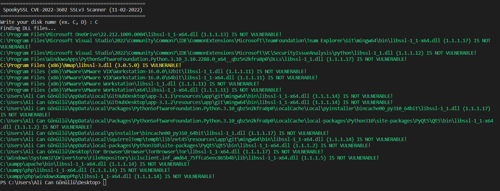

# SpookySSL-Scanner
SpookySSL CVE-2022-3602 SSLv3 Scanner for Windows, Linux, macOS
  
<b>Installation</b>
<ul>
<li>pip install win32api</li>
<li>pip install glob</li>
<li>pip install platform</li>
</ul>
  
<b>Pics</b>

